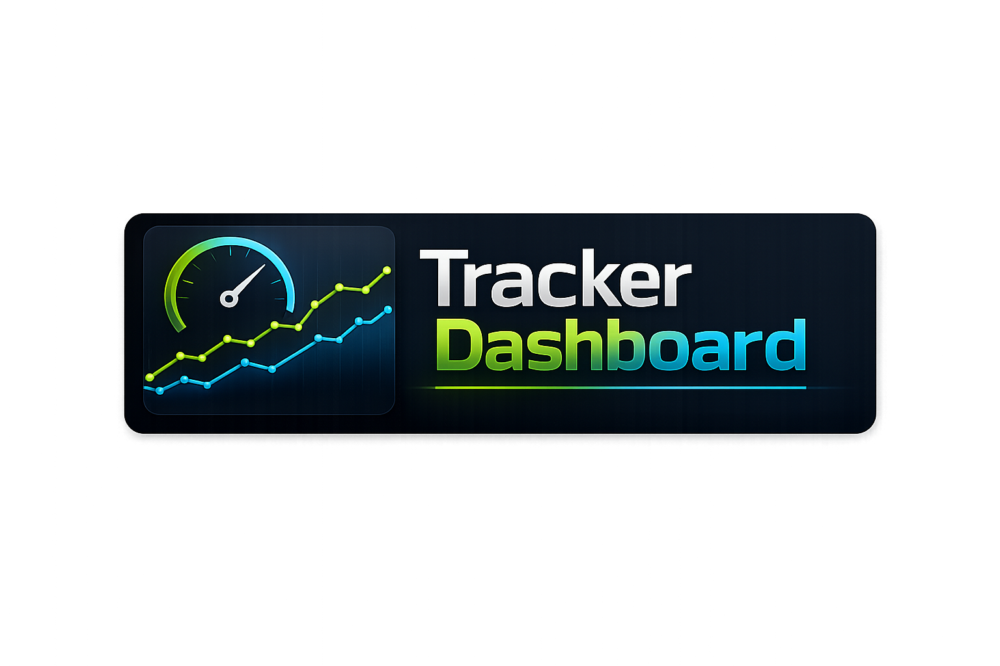
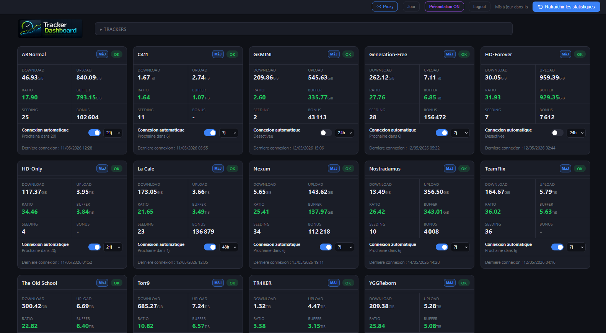
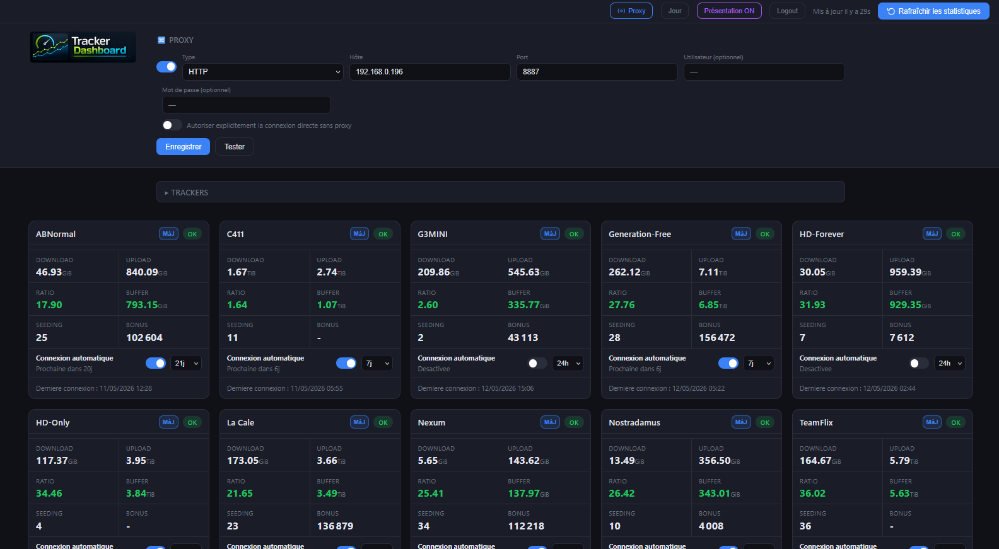
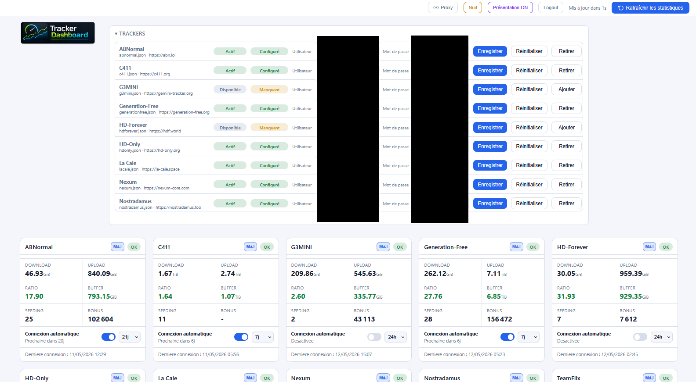

<p align="center">
  
</p>

> **Tu l'utilises ? Tu l'aimes ? [⭐ Mets une étoile !](https://github.com/Aerya/tracker-dashboard/stargazers)** — ça prend deux secondes.

> [!WARNING]
> Lors d’un rafraîchissement général ou du premier lancement, certains trackers peuvent temporairement afficher une erreur ou prendre du temps à se mettre à jour.
>
> Si besoin, lancez une mise à jour individuelle du tracker concerné.
>
> Un goulot d’étranglement existe actuellement au niveau du navigateur headless intégré. Ce point sera retravaillé dans une prochaine version (ou pas).


# Tracker Dashboard

Tracker Dashboard est une WebUI pour suivre les statistiques de trackers BitTorrent : upload, download, ratio, buffer, points bonus, torrents en seed, selon les fonctionnalités du tracker.
Le projet permet de configurer les trackers actifs, leurs identifiants, un proxy HTTP/HTTPS/SOCKS, des connexions automatiques espacées dans le temps et l'historique des statistiques en SQLite.

Au premier accès, l'application demande de créer le compte administrateur de la WebUI.

Export Prometheus + dashboard Grafana — endpoint `/metrics` (protégé par token via la variable d'env `METRICS_TOKEN`) exposant les stats de tous les trackers activés au format Prometheus. Dashboard Grafana JSON fourni dans `grafana/dashboard.json` (jauges de ratio, courbes upload/download par tracker, bonus points, deltas quotidiens, état OK/HS). Voir [grafana/README.md](grafana/README.md) pour l'installation.


### Cookies de session (sites à CAPTCHA / Cloudflare)

Certains trackers protègent leur page de connexion par un CAPTCHA ou un challenge anti-bot (Cloudflare Turnstile, etc.). Le navigateur headless intégré ne peut pas les résoudre automatiquement, et le login échoue.

Pour ces sites, on peut court-circuiter le login en fournissant directement un **cookie de session** : connectez-vous au tracker dans votre navigateur habituel, exportez le cookie, puis collez-le dans le dashboard (liste des trackers → tracker concerné → **Options avancées** → **Cookie de session**). Le dashboard l'injecte dans le navigateur headless avant chaque lecture, ce qui évite complètement la page de login.

Trois formats sont acceptés (auto-détectés) :
- fichier **Netscape `cookies.txt`** (le plus simple) ;
- export **JSON** d'une extension type *Cookie-Editor* ;
- chaîne d'en-tête brute `nom=valeur; nom2=valeur2` copiée depuis les DevTools (F12 → Application/Stockage → Cookies).

Quelques extensions pratiques pour exporter les cookies :
- [cookies-txt](https://github.com/hrdl-github/cookies-txt) (export au format Netscape `cookies.txt`)
- [Cookie-Editor](https://cookie-editor.com/) (export JSON)
- [Get cookies.txt LOCALLY](https://github.com/kairi003/Get-cookies.txt-LOCALLY)

Le cookie est optionnel et propre à chaque tracker : laissez le champ vide pour les sites qui se connectent normalement. Un cookie de session finit par expirer (de quelques heures à plusieurs semaines selon le site) ; il suffit alors d'en recoller un frais.


## Changements récents

- Ajout option refresh 6 et 12h
- Allègement restart du Docker : données < 24h servies en priorité
- Option ProxyLess pour certains trackers (MaM notamment)
- Cookies de sessions pour tous les trackers, pour éviter les complications (captchas, antibots etc) lors des logins via le browser headless
- Ajout CrazySpirits, Seedpool et Tigers-DL (merci jack)
- Ajout "Incident connu" + note libre sur les cartes. Inspiré par LaCale vu le site en ligne mais login HS depuis le 19 mai 2026
- Ajout TorrentLeech (merci NohamR)
- Check de joignabilité en cas d'erreur de login
- Export Prometheus + dashboard Grafana : endpoint `/metrics` protégé par token (`METRICS_TOKEN`) et dashboard JSON prêt à importer dans `grafana/`.


## Captures d'écran

Les captures ci-dessous montrent l'interface avec des données issues du mode Présentation. Les valeurs affichées sont factices et ne reflètent pas des statistiques réelles.








## Fonctionnement général

L'application lit les définitions disponibles dans `config/trackers/*.json` et les ajoutent à une liste de tracker BitTorrent disponibles pour la configuration.
Chaque définition indique comment se connecter au site, quelle page lire et quelles valeurs extraire.

Depuis la WebUI, on peut :

- activer ou retirer un tracker,
- enregistrer ou réinitialiser les identifiants d'un tracker,
- configurer un proxy HTTP, HTTPS, SOCKS4 ou SOCKS5,
- autoriser explicitement la connexion directe sans proxy si ce Docker passe par un VPN (ou si vous aimez sortir à poual, ce qui est fortément déconseillé),
- lancer un rafraîchissement manuel des statistiques,
- activer une connexion automatique par tracker,
- lui choisir un intervalle : 6h, 12h, 24h, 48h, 7 jours ou 21 jours.

Les données persistantes sont stockées dans SQLite, dans le volume `config` monté.


## Sécurité proxy

Par défaut, les connexions aux trackers sont bloquées si aucun proxy n'est actif.
Pour autoriser les connexions, il faut soit :
- configurer et activer un proxy,
- cocher explicitement l'option de connexion directe sans proxy.
Cette sécurité s'applique aussi au premier lancement du conteneur.


## User-Agent aléatoire

Les connexions utilisent une rotation automatique de User-Agents issue du paquet `top-user-agents`. Il est choisi automatiquement pour les nouvelles sessions HTTP et les nouveaux contextes navigateur.


## Connexions automatiques

Chaque tracker peut avoir sa propre planification automatique.
La WebUI permet de choisir 24h/48h/7j/21j.
L'application calcule ensuite une prochaine exécution pour chaque tracker. Le bouton `Rafraîchir les statistiques` permet de lancer un rafraîchissement manuel.


En cas de timeout ponctuel non marque comme incident connu, les dernieres donnees valides restent affichees avec un indicateur orange, puis le dashboard retente automatiquement 3 fois toutes les 10 minutes, puis 3 fois toutes les heures, avant d'attendre la prochaine connexion automatique prevue.


## Sites intégrés

Les définitions de sites déjà fournies sont disponibles directement dans :

```text
config/trackers/
```

Chaque fichier JSON correspond à un site et contient sa configuration de connexion, la page à lire et les champs à extraire.

N'hésitez pas à me partager vos définitions, que je les ajoute au Docker.


## Ajouter un nouveau site

Pour ajouter un tracker, il faut créer un fichier JSON dans :

```text
config/trackers/
```

Pour préparer l'ajout d'un site, il faut idéalement fournir :
- le nom du site,
- l'URL de base du site,
- l'URL de la page de login,
- la méthode de login si elle est particulière (combinaison de touches pour accéder au login etc),
- l'URL de la page qui contient les statistiques du compte,
- le code source HTML de cette page une fois connecté,
- les noms exacts des valeurs à récupérer : upload, download, ratio, bonus, buffer, seeding, etc,
- si le site utilise un CMS connu, par exemple UNIT3D, Gazelle, Luminance...

Les champs habituellement exploités par le tableau de bord sont :

| Champ | Usage |
|---|---|
| `uploadedBytes` | Upload |
| `downloadedBytes` | Download |
| `ratio` | Ratio |
| `bufferBytes` | Buffer |
| `seeding` | Torrents en seed |
| `seedBonus` | Points bonus |
| `tokens` | Jetons ou tokens |

Si le ratio n'est pas présent sur le site mais que l'upload et le download sont disponibles, le tableau de bord peut le calculer.
Si le buffer n'est pas fourni par le site, il peut être calculé à partir de l'upload et du download.


## Format simplifié d'une définition

Exemple schématique :

```json
{
  "id": "example",
  "name": "Example Tracker",
  "baseUrl": "https://example.org",
  "enabled": false,
  "login": {
    "url": "login",
    "method": "POST",
    "contentType": "form",
    "body": {
      "username": "{{username}}",
      "password": "{{password}}"
    },
    "failurePatterns": ["login"]
  },
  "fetch": {
    "url": "account",
    "mode": "http",
    "responseType": "html",
    "fields": {
      "uploadedBytes": {
        "regex": "Upload[^0-9]*(?<value>[0-9.,]+\\s*(?:GB|GiB|TB|TiB))",
        "transform": "bytes"
      }
    }
  }
}
```


## Transformations disponibles

| Transformation | Effet |
|---|---|
| `bytes` | Convertit une taille comme `1.5 GB`, `800 MiB`, `2 To`, `276 Gio` en nombre d'octets |
| `number` | Convertit en nombre décimal |
| `integer` | Convertit en entier |
| `string` | Conserve la valeur en texte |
